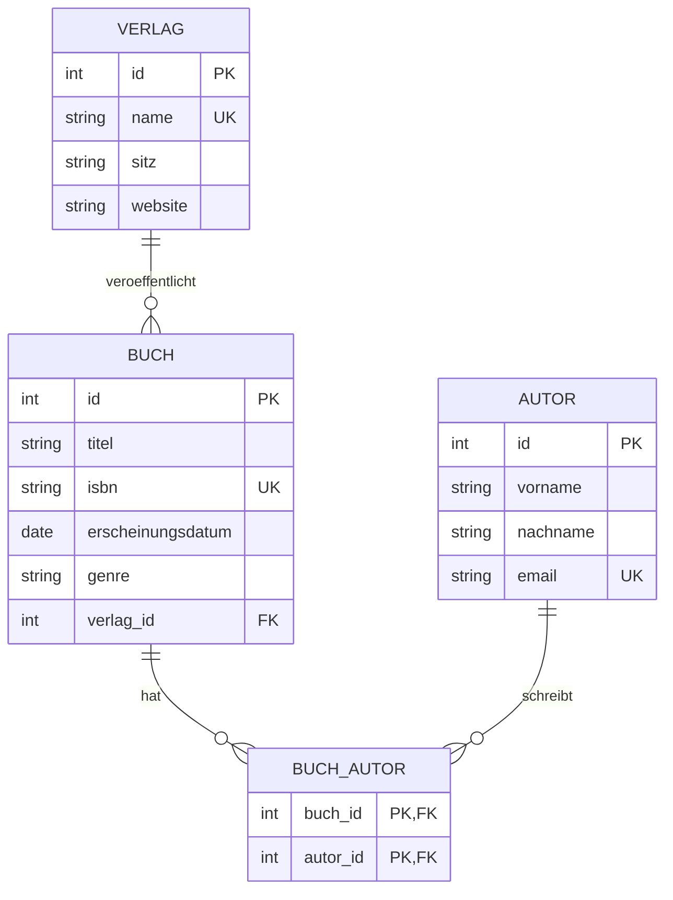

# ER-Diagramm

```mermaid
erDiagram
    VERLAG ||--o{ BUCH : veroeffentlicht
    BUCH ||--o{ BUCH_AUTOR : hat
    AUTOR ||--o{ BUCH_AUTOR : schreibt
    VERLAG {
        int id PK
        string name UK
        string sitz
        string website
    }
    BUCH {
        int id PK
        string titel
        string isbn UK
        date erscheinungsdatum
        string genre
        int verlag_id FK
    }
    AUTOR {
        int id PK
        string vorname
        string nachname
        string email UK
    }
    BUCH_AUTOR {
        int buch_id PK, FK
        int autor_id PK, FK
    }
```

Das Buch ist der Aggregate Root. Autoren und Verlag sind eigenständige Referenzen;
die Zuordnung der Autoren zu einem Buch wird über `buch_autor` gespeichert.
