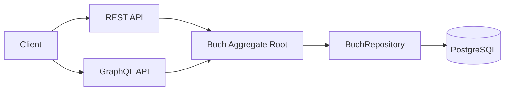

# Komponenten

```mermaid
flowchart LR
    Client --> REST[REST API]
    Client --> GQL[GraphQL API]
    REST --> Root[Buch Aggregate Root]
    GQL --> Root
    Root --> Repo[BuchRepository]
    Repo --> DB[(PostgreSQL)]
```
