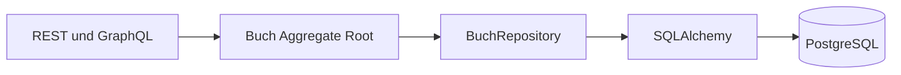

# Schichtenarchitektur

```mermaid
flowchart LR
    API[REST und GraphQL] --> AGG[Buch Aggregate Root]
    AGG --> REPO[BuchRepository]
    REPO --> ORM[SQLAlchemy]
    ORM --> DB[(PostgreSQL)]
```
